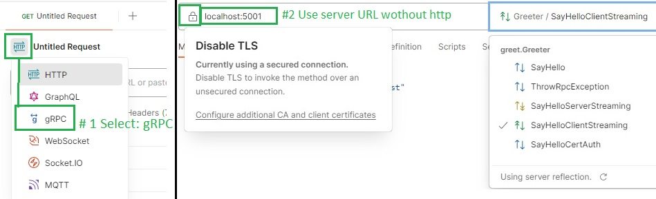

# Playing with .NET Core gRPC
Explore the fundamentals and features of the gRPC Remote Procedure Call (RPC) framework in .NET. It is a good fit for high-performance or streaming communication between microservices.

#### Projects in the solution

`Grpc.Demo.ProtoLib`

- Contains the proto file in a common library for the client and server projects
- CertificateHelper.cs: It is used to read the certificate from the Current User Store

`Grpc.Demo.WebServer`

- gRPC server implementation (unary call, throw RpcException, server and client streaming, define enum and timestamp types)
- Implement *Certificate Authentication*. You can use the *MakeCerts.ps1* to create development client a server certificates

`Grpc.Demo.ConsoleClient`

- gRPC client implementation for console application

`Grpc.Demo.WorkerServiceClient`

- gRPC client implementation for *worker service* using *gRPC client factory*

#### Resources

- [Overview for gRPC on .NET](https://docs.microsoft.com/en-us/aspnet/core/grpc) 📚
- [gRPC for .NET Examples](https://github.com/grpc/grpc-dotnet/tree/master/examples#grpc-for-net-examples) 👤*grpc-dotnet*
- [.NET Core ❤ gRPC](https://grpc.io/blog/grpc-on-dotnetcore/) 📓*grpc.io*
- [Protocol Buffers Documentation](https://protobuf.dev) 📓*protobuf.dev*
- [Ebook - gRPC for WCF developers](https://github.com/dotnet-architecture/eBooks/blob/1ed30275281b9060964fcb2a4c363fe7797fe3f3/current/grpc-for-wcf-developers/gRPC-for-WCF-Developers.pdf) 👤*.NET Architecture*
- [Protobuf data types](https://learn.microsoft.com/en-us/aspnet/core/grpc/protobuf) 📚*MS-Learn*
- Adding features: [GrpcReflection testing services with Postman](https://learn.microsoft.com/en-us/aspnet/core/grpc/test-tools) 📚 *(see below)* and [JSON transcoding](https://learn.microsoft.com/en-us/aspnet/core/grpc/json-transcoding) 📚
  - [gRPC Reflection and JSON transcoding](https://youtu.be/et_2NBk4N4Y?t=448) 📽️*25min, James Newton-King*
  - [Enabling gRPC server reflection](https://irina.codes/enabling-grpc-server-reflection/) 📓*IrinaScurtu*
---
- [Using gRPC in ASP.NET Core](https://app.pluralsight.com/library/courses/aspnet-core-grpc/table-of-contents) 📽️*Pluralsight - Shawn Wildermuth, 2h 32min*
- [Talking between services with gRPC](https://www.youtube.com/watch?v=W-bULzA0ki8) 📽️*NET Core Summer Event - Marc Gravell, 50min*
- [gRPC for ASP.NET Core](https://www.youtube.com/watch?v=JpM95-Wplzo) 📽️*NDC Conferences - James Newton-King, 1h*

---

- [Message validation with FluentValidation](https://anthonygiretti.com/2020/05/18/grpc-asp-net-core-3-1-model-validation) 📓*Anthony Giretti*

---

